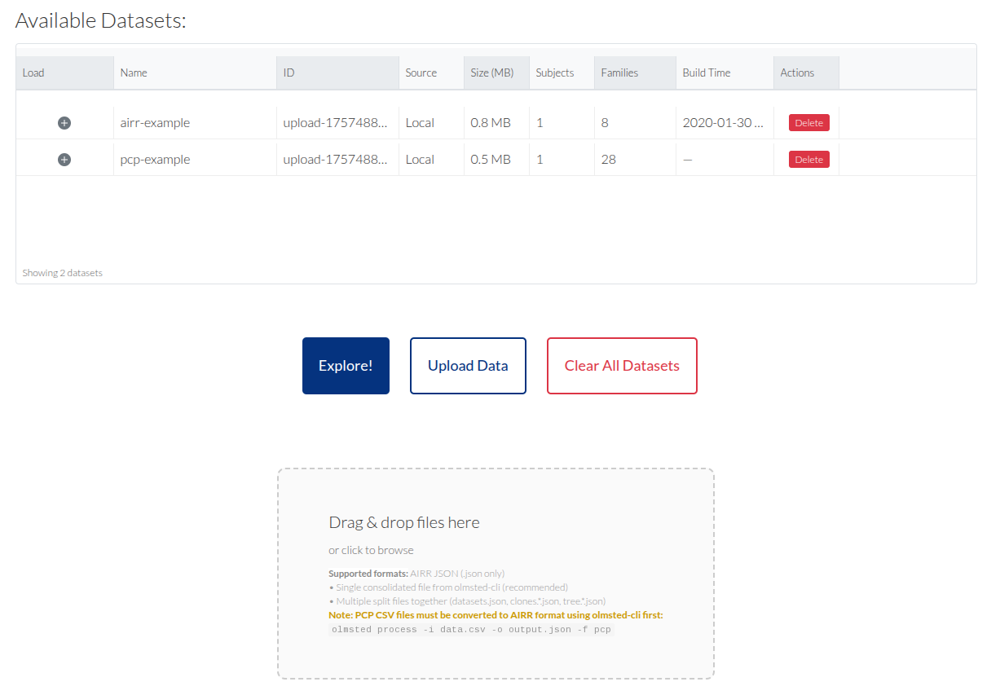
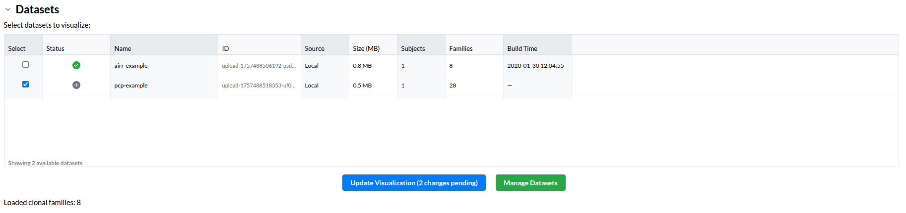
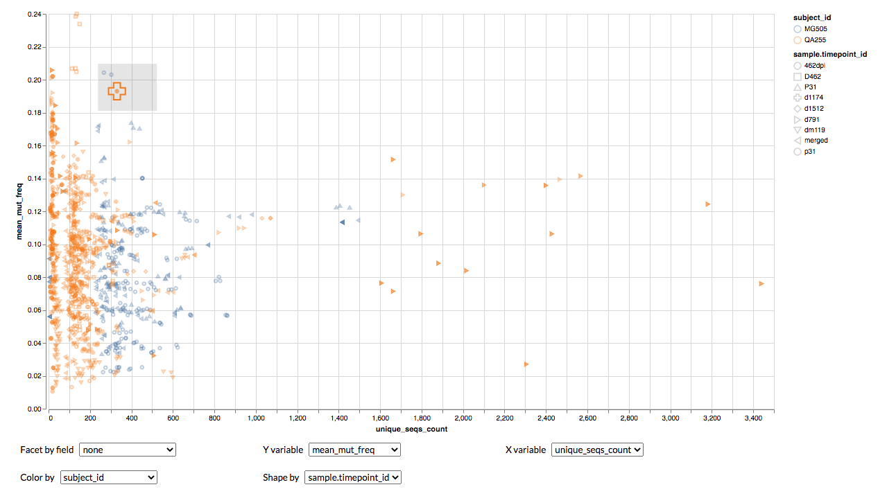
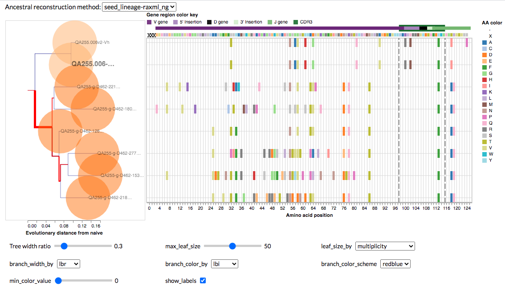
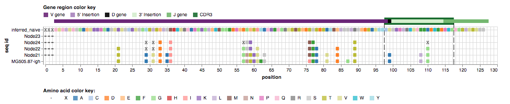

# Olmsted


*After landscape architect [Fredrick Law Olmsted](https://en.wikipedia.org/wiki/Frederick_Law_Olmsted)*

Olmsted is an open-source tool for visualizing and exploring B cell lineages. You can visit a live demo application at <http://olmstedviz.org>, and use the [guide below](https://github.com/matsengrp/olmsted#guide) to direct your time there.

  - [Overview](#overview)
  - [Quickstart](#quickstart)
  - [Preparing input data](#preparing-input-data)
  - Deployment
    - [with Docker](#Deployment-with-Docker)
    - [without Docker](#Deploying-without-Docker)
  - [Static Build](#Static-Build)
  - [Using the visualization](#using-the-visualization)
  - [Miscellany](#Miscellany)

## Overview

In the human immune system, affinity maturation of B cell receptor sequences coding for immunoglobulins (i.e. antibodies) begins with a diverse pool of randomly generated naive sequences and leads to a collection of evolutionary histories.
It is now common to apply high-throughput DNA sequencing to the B cell repertoire and then reconstruct these evolutionary histories using specialized algorithms.
However, researchers often lack the tools to explore these reconstructions in the detail necessary to, for example, choose sequences for further functional, structural, or biochemical studies.
We aim to address this need with Olmsted: a browser-based application for visually exploring B cell repertoires and clonal family tree data.
Olmsted allows the user to scan across collections of clonal families at a high level using summary statistics, and then hone in on individual families to visualize phylogenies and mutations.
This will enable lab-based researchers to more quickly and intuitively identify lineages of interest among vast B cell sequencing datasets, and move forward with in-depth analyses and testing of individual antibodies.

## Quickstart

### 1. Clone the repositories

First, clone the main Olmsted repository:

```bash
git clone https://github.com/matsengrp/olmsted.git
cd olmsted
git submodule update --init
cd ..
```

Then clone the olmsted-cli data processing tool:

```bash
git clone https://github.com/matsengrp/olmsted-cli.git
```

### 2. Install olmsted-cli

Create a conda environment and install olmsted-cli in development mode:

```bash
conda create -n olmsted python=3.9
conda activate olmsted
cd olmsted-cli
pip install -e .
cd ..
```

### 3. Build and run Olmsted server

#### Option A: Using Docker (Recommended)

Navigate to the main olmsted directory, build the container, and start the server:

```bash
cd olmsted
docker build -t olmsted:latest .
./bin/olmsted-server.sh olmsted:latest 3999
```

#### Option B: Local installation

For local installation, you'll need to install Node.js dependencies, create a data directory, and start the server:

```bash
cd olmsted
npm install --legacy-peer-deps --ignore-scripts
mkdir -p _data
./bin/olmsted-server-local.sh _data/ 3999
```

### 4. Process your data with olmsted-cli

Use olmsted-cli to convert your data into Olmsted format. Here are examples using the provided sample data in the olmsted-cli directory:

**Processing PCP format data:**
```bash
olmsted process -i olmsted-cli/example_data/pcp/pcp.csv -t olmsted-cli/example_data/pcp/trees.csv -o processed_data.json -f pcp -n "pcp-example"
```

**Processing AIRR format data:**
```bash
olmsted process -i olmsted-cli/example_data/airr/full_schema_dataset.json -o processed_data.json -f airr -n "airr-example"
```

**Note**: The `--format` flag is optional as `olmsted process` can automatically infer the input file format from the file extension and contents.

### 5. Access the web application

Open your browser and navigate to `localhost:3999` to see the Olmsted interface.

### 6. Upload and explore your data

Once in the web application:
- **Upload data**: Use the file explorer to browse and upload your processed JSON files, or simply drag and drop them onto the upload area
- **Select datasets**: Choose the desired datasets from the database table by clicking the checkbox next to each dataset
- **Start exploring**: Click the "Explore!" button to begin visualizing your B cell lineage data

**Note**: You must select at least one dataset before clicking "Explore!" or you'll see an empty display.  You can also select dataset from the Dataset table on the visualization page.

## Data Processing with olmsted-cli

### Overview

We now use [olmsted-cli](https://github.com/matsengrp/olmsted-cli) to format data into a single unified file format that can be uploaded to the Olmsted web application. The olmsted-cli package provides a streamlined command-line interface for converting various data formats (AIRR, PCP, etc.) into the standardized format required by Olmsted.

### Basic API Usage

The olmsted-cli tool provides a simple `process` command:

```bash
olmsted process [OPTIONS]
```

**Note**: Use `olmsted process -h` for more options.

**Common options:**
- `--input, -i`: Input file path (PCP CSV or AIRR json)
- `--output, -o`: Output file path (defaults to `olmsted_output.json`)
- `--format, -f`: Input format (`airr`, `pcp`) (optional, olmsted-cli can infer input file type in most situations)
- `--name, -n`: Dataset name (optional, but recommended for olmsted database navigation)

**PCP options:**
- `--input-trees, -t`: Tree data CSV file path

**AIRR options:**
- `--naive-name`: Name of naive/root node for tree rooting
- `--root-trees, -r`: Root trees

**Examples:**

Process a PCP CSV file with separate tree data file:
```bash
olmsted process -i data.csv -t trees.csv -o processed.json -f pcp -n "PCP Dataset"
```

Process an AIRR format file:
```bash
olmsted process -i data.json -o processed.json -f airr -n "AIRR Dataset"
```

### Input format

Olmsted supports two primary input formats:

#### PCP Format

The PCP (Parent Child Pair) format consists of two CSV files:

1. **Parent Child Pair CSV**: Contains data for each parent-child pair with columns:
   - `sample_id`: Sample identifier
   - `family`: Family identifier
   - `parent_name`: Parent node name
   - `parent_heavy`: Parent heavy chain sequence
   - `child_name`: Child node name
   - `child_heavy`: Child heavy chain sequence
   - `branch_length`: Branch length between parent and child
   - `depth`: Depth in tree structure
   - `distance`: Distance from root
   - `v_gene_heavy`: V gene assignment for heavy chain
   - `j_gene_heavy`: J gene assignment for heavy chain
   - `cdr1_codon_start_heavy`: CDR1 start position in heavy chain
   - `cdr1_codon_end_heavy`: CDR1 end position in heavy chain
   - `cdr2_codon_start_heavy`: CDR2 start position in heavy chain
   - `cdr2_codon_end_heavy`: CDR2 end position in heavy chain
   - `cdr3_codon_start_heavy`: CDR3 start position in heavy chain
   - `cdr3_codon_end_heavy`: CDR3 end position in heavy chain
   - `parent_is_naive`: Boolean indicating if parent is naive/root
   - `child_is_leaf`: Boolean indicating if child is leaf node

2. **Tree Data CSV**: Contains Newick data with columns:
   - `family_name`: Family identifier matching the family column above
   - `sample_id`: Sample identifier
   - `newick_tree`: Newick format phylogenetic tree string

Example PCP data can be found in the `olmsted-cli/example_data/` directory, demonstrating the expected structure and column formats.

#### AIRR Format

Olmsted takes input files in the [AIRR JSON format](https://github.com/airr-community/airr-standards/blob/master/specs/airr-schema.yaml).
A list of tools that output this format can be found [here](https://docs.airr-community.org/en/stable/resources/rearrangement_support.html).
For a human-readable version of the schema, see [olmstedviz.org/schema.html](http://www.olmstedviz.org/schema.html) or view [schema.html](https://github.com/matsengrp/olmsted/blob/master/schema.html) on [htmlpreview.github.io](https://htmlpreview.github.io).

### Validation

#### Using olmsted-cli for Validation

The olmsted-cli package provides built-in validation capabilities to ensure your data meets the required schema standards before processing:

**Validation-only mode:**
```bash
olmsted validate --input your_data.json
```

**Validation during processing:**
```bash
olmsted process --input your_data.json --output processed.json --validate
```

## Deployment with Docker

1. Install [Docker](https://www.docker.com/get-started)
2. Choose a port number available to you locally, e.g. 8080
3. Choose a [version tag](https://quay.io/repository/matsengrp/olmsted?tab=tags) e.g. `v2.1.1-11-gec852b7` - we recommend that you choose a specific tag even if you want the latest version, i.e. that you don't use the `latest` tag, if you want to be able to reproduce your efforts later.
4. Start the server (this can be stopped at any time with ctrl-C):
```
docker run -p 8080:3999 quay.io/matsengrp/olmsted
```
5. Navigate to `localhost:8080` in your browser to see the application.

To run an interactive session in the container:
```
docker run -it quay.io/matsengrp/olmsted /bin/bash
```

## Static Build

Olmsted is designed to statically compile as a single page app, which can then be deployed using a simple CDN setup.

To create a static deployment, run `npm run build` from within the project directory (the path to your clone of this repository or `/usr/src/app` in the Docker image).
This will generate most of a deployment in a `deploy` directory.
To complete the static deployment, you simply have to place the data you want to deploy at `deploy/data`.

You can test the local static build by running the following:

```
cd deploy
python -m SimpleHTTPServer 4000
```
Use ctrl-C to stop the server.
Once you've verified that your static build works, you simply have to deploy the contents to a static file server or CDN.

If you're content deploying with AWS S3, there is a deploy script at `bin/deploy.py` which you can use to push your static deployment up to an S3 bucket.
For deploy script usage run `./bin/deploy.py -h`.
To see what you need to do on the S3 side to acitvate website hosting for a bucket, see: <https://docs.aws.amazon.com/AmazonS3/latest/dev/WebsiteHosting.html>

## Using the visualization

### Dataset Selection and Management

Upon launching Olmsted and navigating in a browser to the appropriate address (or using the example at http://olmstedviz.org), you will find the home page with a table of the available datasets:



Olmsted uses a client-side database to manage your datasets within the browser. This database is managed from the splash page, where you can load new datasets and delete existing ones.  You can upload datasets by clicking the "Upload Data" and navigating file explorer, or via the drag-n-drop box below.  This will add the dataset to the list of Available Datasets above.  When you check the load icon for the row in the datasets table, it queues the dataset for visualization and adds it to the query string. Click *Explore!* to visually explore selected datasets.



Once you're in the visualization interface, you can change your dataset selection on demand. Simply select the desired datasets in the dataset table on the visualization page, then click the "Update Visualization" button to refresh the view with your new selection. "Manage Datasets" will return you to the splash page.

### Clonal Families Section (AKA "scatterplot")

The *Clonal Families* section represents each clonal family as a point in a scatterplot:



Choose an immunoglobulin locus to restrict the clonal families in the scatterplot to that locus - the default is immunoglobulin gamma, or *igh* (where *h* stands for heavy chain).
In order to visualize all clonal families from all loci in the dataset at once, choose "ALL" in the locus selector.
By default, the scatterplot maps the number of unique members in a clonal family, `unique_seqs_count`, to the x-axis, and the average mutation frequency among members of that clonal family, `mean_mut_freq`, to the y-axis.
However, you may configure both axes as well as the color and shape of the points to map to a range of fields, including sequence sampling time (see below).

For comparison of subsets, you may *facet* the plot into separated panels according to data values for a range of fields:


Interact with the plot by clicking and dragging across a subset of points or clicking individual points to filter the resulting clonal families in the *Selected clonal families* table below.

### Selected Clonal Families Section (AKA "table")
Below the scatterplot, the full collection or selected subset of clonal families appears in a table including a visualization of the recombination event resulting in the naive antibody sequence and a subset of clonal family metadata:


Each row in the table represents one clonal family.
The table automatically selects the top clonal family according to the sorting column.
Click on the checkbox in the "Select" column in the table to select a clonal family for further visualization.
Upon selecting a clonal family from the table, the phylogenetic tree(s) corresponding to that clonal family (as specified in the input JSON) is visualized below the table in the Clonal family details section.

### Clonal Family Details Section (AKA "tree" and "alignment")
For a selected clonal family, its phylogenetic tree is visualized below the table in the *Clonal family details* section:




Select among any alternate phylogenies using the *Ancestral reconstruction method* menu.
Note that these ancestral reconstruction methods are according to those specified in the input data according to the phylogenetic inference tool used to produce them - Olmsted does not perform ancestral reconstruction (or any phylogenetic inference at all).
Alongside the tree is an alignment of the sequences at the tree's tips.
Colors indicate amino acid mutations at each position that differs from the sequence at the root of the tree (typically the family's inferred naive antibody sequence).
Scroll while hovering over the tree to zoom in and out.
Click and drag the zoomed view to pan in a traditional map-style interface.
The alignment view on the right zooms in the vertical dimension according to the zoom status of the tree.
The tree's leaves use pie charts to show the multiplicity (i.e. the number of downsampled and deduplicated sequences) represented by a given sequence, colored according to sampling timepoint. See [the schema](http://www.olmstedviz.org/schema.html) for more detailed field descriptions.

Note that often in example data the number of sequences in a clonal family has been downsampled to build a tree (see downsampled_count, downsampling_strategy in [the schema](http://www.olmstedviz.org/schema.html)), which explains why a clonal family might be listed in the table as having a few thousand unique sequences, but upon selecting the clonal family, the corresponding tree visualization only contains 10s or 100s of sequences.

Use the interface below the tree to configure:

- Maximum width of the tree window with respect to the alignment window
- Field mapped to the size of tree leaves (pie charts)
- Maximum size of the tree leaves
- Tree tip labels
- Fields mapped to branch width and color


In order to get more details about a particular lineage in the tree, click on a leaf's label (or circle if the labels are hidden) - the *Ancestral Sequences* section will appear below the tree.

### Ancestral Sequences Section (AKA "lineage")

The *Ancestral Sequences* section displays an alignment of the selected sequence with its ancestral lineage starting from the naive sequence:



Mutations from the naive sequence are shown as in the *Clonal Family Details* section.

## Miscellany
### Versioning
We use git tags to tag [releases of Olmsted](https://github.com/matsengrp/olmsted/releases) using the [semver](https://semver.org/) versioning strategy.

Tag messages, e.g. `Olmsted version 2.0.1 ; uses schema version 2.0.0`, contain the [version of the input data schema](https://github.com/matsengrp/olmsted/blob/master/bin/process_data.py#L18) with which a given version of Olmsted is compatible.

The tagged release's major version of Olmsted should always match that of its compatible schema version; should we need to make breaking changes to the schema, we will bump the major versions of both Olmsted and the input schema.

### Implementation notes
This application relies on React.js and Redux for basic framework, and Vega and Vega-Lite for the interactive data visualizations.

### License and copyright
Copyright 2019 Christopher Small, Eli Harkins, and Erick Matsen.
Forked from [Auspice](https://github.com/nextstrain/auspice), copyright 2014-2018 Trevor Bedford and Richard Neher.

Source code to Olmsted is made available under the terms of the [GNU Affero General Public License](LICENSE.txt) (AGPL). Olmsted is distributed in the hope that it will be useful, but WITHOUT ANY WARRANTY; without even the implied warranty of MERCHANTABILITY or FITNESS FOR A PARTICULAR PURPOSE.  See the GNU Affero General Public License for more details.
