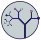
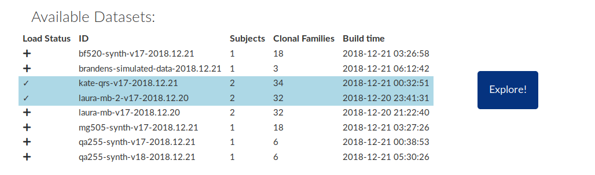
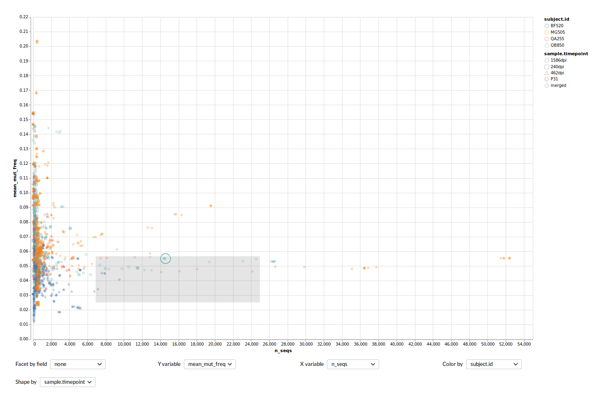
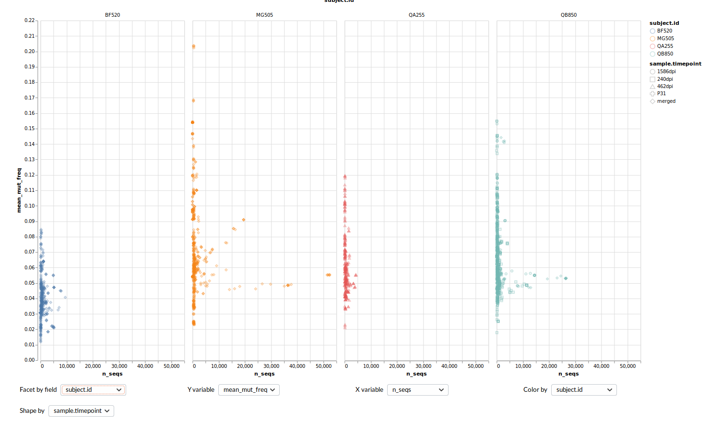
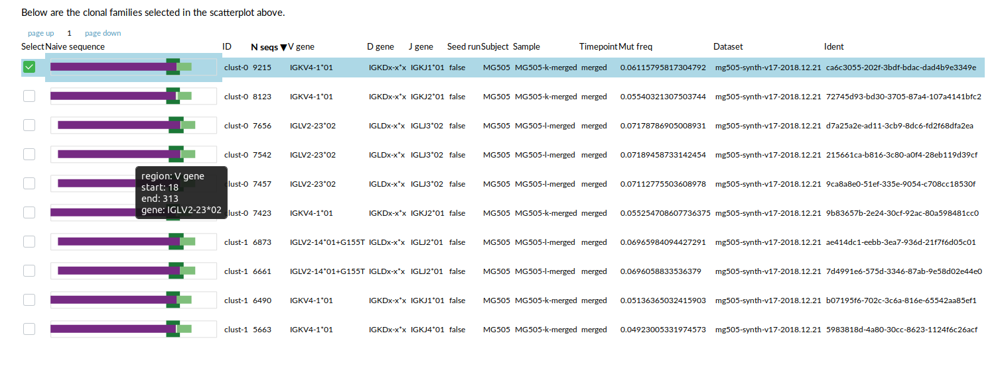
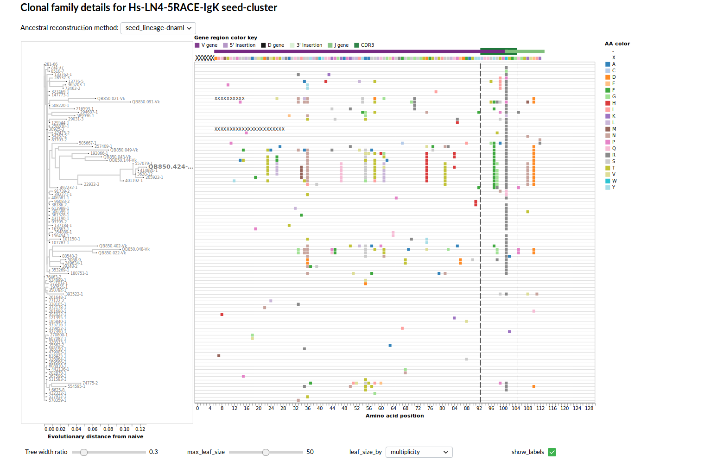
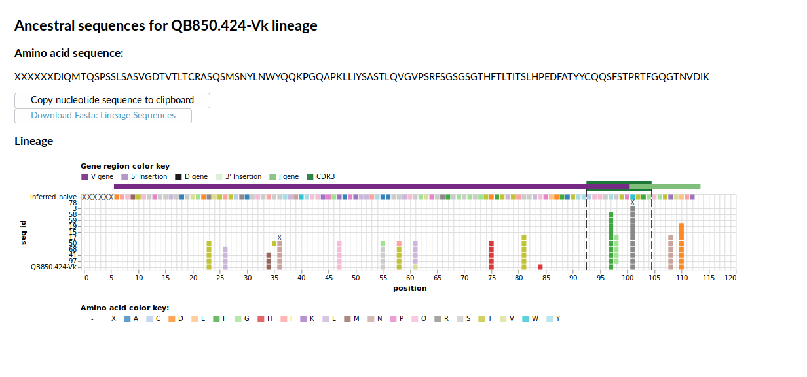

# Olmsted



*After [Fredrick Law Olmsted](https://en.wikipedia.org/wiki/Frederick_Law_Olmsted), a tree-hugger considered the father of landscape architecture*


## Introduction

Olmsted is an open-source tool for visualizing and exploring the adaptive immune system.

B-cells code for and generate _antibodies_, proteins which stick to some exposed structure (_antigen_) on a virus or bacteria.
Recently, it has become possible to deep sequence B-cell receptor genes (millions of sequences per sample in some cases), giving us an in depth snapshot of the adaptive immune system at a point in time.

Olmsted combines powerful interactive data visualizations as part of an explorer flow in which repertoires can be explored in depth, unlocking a birds eye view of this data.

You can visit a live demo application at <http://olmstedviz.org>, and use the guide below to direct your time there.


## Guide

When you first hit the application at it's root address, you'll be presented with a page where you can select data for exploration.



Once selected, hitting "Explore" takes you to a page which encodes for the selected datasets:

<http://olmstedviz.org/app?selectedDatasets=bf520-synth-v17-2018.12.21&selectedDatasets=kate-qrs-v17-2018.12.21&selectedDatasets=mg505-synth-v17-2018.12.21>

### Clonal family scatterplot

The top level component in the explorer view is a scatterplot of all the clonal families in your selected datasets.
The axes, color and symbol mappings are all customizable.



It's also possible to facet the visualization by a variable, which splits it up into separate panes, one for each value corresponding to the selected variable.
For example, we might want to facet by subject to get a better sense of how trends compare between subjects



### Clonal family table

In the main clonal family scatterplot, you can click and drag to select a set of points in the plot.
When you do, the selection acts as a filter for the clonal families table.

This table shows additional details about the selected clonal families, including a visual encoding of the gene rearrangement responsible for the clonal family's naive B-cell.
You can also click on a column header of the table to sort by that column.



### Tree and alignment view

Clicking on a row of the table presents further details about the clonal family, including a phylogenetic tree of select sequences from the family, and a visualization of the mutation patterns in the selected sequences.
As with other visualizations in the application, the details of color and node size can be controlled.



### Lineage view

Clicking on a tip in the phylogenetic tree displays additional details about the series of mutations leading up to the sequence in question.




## Run with Docker

To run Olmsted, you can either:
- clone this repository and use npm to install the necessary dependencies (see "Install")
- use Docker:

1. Install [Docker](https://www.docker.com/get-started)
2. Choose a port number available to you locally, e.g. 8080
3. Run:
```
docker run -p 8080:3999 quay.io/matsengrp/olmsted
```
4. Navigate to `localhost:8080` in your browser to see the application.

To run on your own data (see "Input data" below for processing input) instead of the example data, you need to point Docker to your data.

For example, if your data is located on your system at `/local/data/path`, that would look like this:
```
docker run -p 8080:3999 -v /local/data/path:/data quay.io/matsengrp/olmsted npm start localData /data
```

## Install

To install Olmsted, clone the git repository

```
git clone https://github.com/matsengrp/olmsted.git
cd olmsted
```

You'll need Node.js to run Olmsted.
You can check if node is installed with `node --version`.
With Node.js present you can install olmsted with

```
npm install
# or, if this fails due to permissions issues
sudo npm install
```

You may also need to install libcairo

```
sudo apt-get install libcairo2 libcairo2-dev
```

## Input data


Olmsted uses [json-schema](https://json-schema.org/) to standardize input data.
For a human-readable version of the schema, see [olmstedviz.org/schema.html](http://www.olmstedviz.org/schema.html) or view [schema.html](https://github.com/matsengrp/olmsted/blob/master/schema.html
) on [htmlpreview.github.io](https://htmlpreview.github.io)

Input data is processed using the script `bin/process_data.py` to ensure required fields using the schema. 
The script takes one JSON file containing one or many datasets with all schema attributes nested under one another, and breaks this apart into files summarizing individual records in the dataset (e.g. clonal families, trees) which can be served to the Olmsted client and visualized. 


To parse input JSON files, use bin/process_data.py. E.g.:

``` 
./bin/process_data.py -i example_data/full_schema_input.json -o example_data/build_data -v -n inferred_naive
```

Run ` ./bin/process_data.py --help` for more on how to run that Python script to parse your data according to the json-schema.

### Generating input data

Olmsted is a visualization tool and should not depend on the methods used for clustering sequences into clonal families, inferring phylogenetic trees among them, etc.

One set of tools we have had success with is [partis](https://github.com/psathyrella/partis) for inferring clonal families and naive sequences, and [CFT](https://github.com/matsengrp/cft) for inferring phylogenetic trees and ancestral sequences. 

## Deployment

A local server can be deployed like this:
`npm start localData ./example_data/build_data 8080`
After building your own data as in the above section, replace `./example_data/build_data` with the output (`-o`) from `bin/process_data.py`.
Navigate to `localhost:8080` in your browser to see the application. 

## Static Build

Olmsted is designed to statically compile as a single page app, which can then be deployed using a simple CDN setup.

To create a static deployment, run `npm run build` from within the project directory.
This will generate most of a deployment in a `deploy` directory.
To complete the static deployment, you simply have to place the data you want to deploy at `deploy/data`.

You can test the local static build by running the following:

```
cd deploy
python -m SimpleHTTPServer 4000
```

Once you've verified that your static build works, you simply have to deploy the contents to a static file server or CDN.

If you're content deploying with AWS S3, there is a deploy script at `bin/deploy.py` which you can use to push your static deployment up to an S3 bucket.
For deploy script usage run `./bin/deploy.py -h`.
To see what you need to do on the S3 side to acitvate website hosting for a bucket, see: <https://docs.aws.amazon.com/AmazonS3/latest/dev/WebsiteHosting.html>

## Versioning

We use git tags to tag [releases of Olmsted](https://github.com/matsengrp/olmsted/releases) using the [semver](https://semver.org/) versioning strategy.


Tag messages, e.g. `schema v1.0.0`, contain the [version of the input data schema](https://github.com/matsengrp/olmsted/blob/master/bin/process_data.py#L18) with which a given version of Olmsted is compatible. 

The tagged release's major version of Olmsted should always match that of its compatible schema version; should we need to make breaking changes to the schema, we will bump the major versions of both Olmsted and the input schema.

## Implementation notes

This application relies on React.js and Redux for basic framework, and Vega and Vega-Lite for the interactive data visualizations.


## License and copyright

Copyright 2019 Christopher Small, Eli Harkins, and Erick Matsen 
forked from Auspice Copyright 2014-2018 Trevor Bedford and Richard Neher.

Source code to Olmsted is made available under the terms of the [GNU Affero General Public License](LICENSE.txt) (AGPL). Olmsted is distributed in the hope that it will be useful, but WITHOUT ANY WARRANTY; without even the implied warranty of MERCHANTABILITY or FITNESS FOR A PARTICULAR PURPOSE.  See the GNU Affero General Public License for more details.


