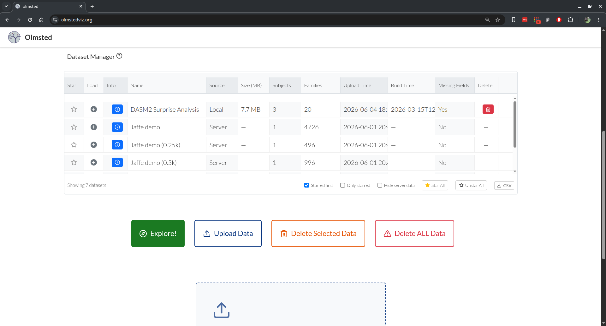
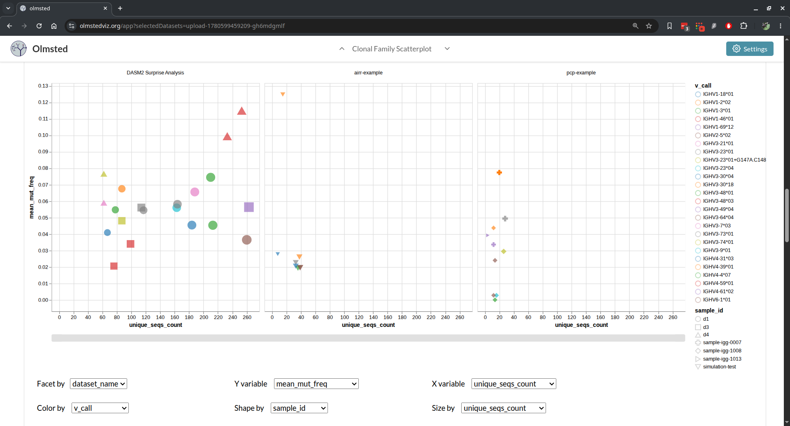
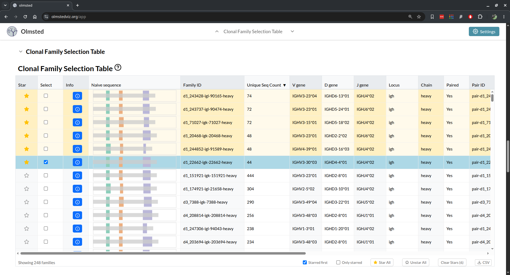
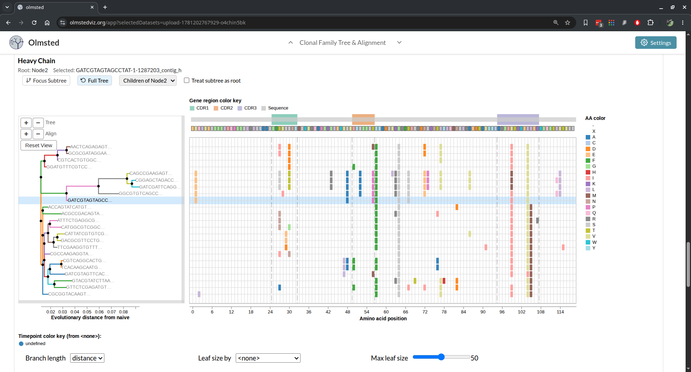
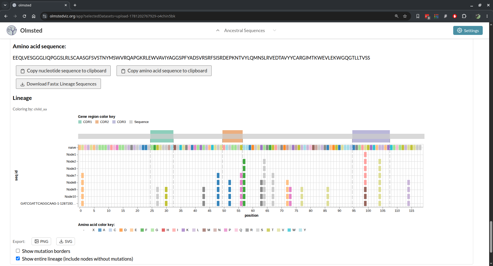
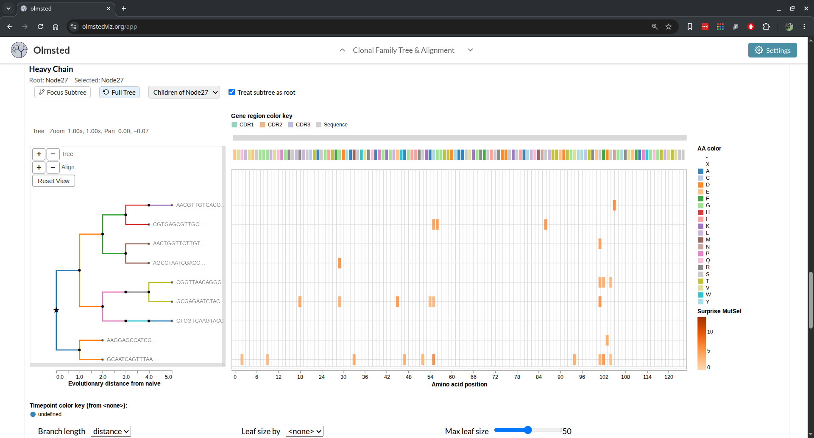

# Summary

Olmsted is an open-source, browser-based application for visually exploring B cell repertoires and clonal family tree data.
The immune system learns to recognize new threats by mutating and selecting the cells that produce antibodies, a process that leaves behind a branching evolutionary record much like a family tree.
In immunological terms, this affinity maturation of B cell receptor sequences coding for immunoglobulins (antibodies) begins with a diverse pool of randomly generated naive sequences and leads to a collection of evolutionary histories.
High-throughput DNA sequencing of the B cell repertoire, combined with computational reconstruction of these evolutionary histories, produces large collections of clonal families and their associated phylogenetic trees.
Olmsted enables researchers to scan across collections of clonal families using summary statistics, then interactively explore individual families to visualize phylogenies and amino acid mutations that occurred during affinity maturation.

# Statement of Need

Researchers studying B cell responses rely on high-throughput sequencing to characterize antibody repertoires.
Computational tools can reconstruct the evolutionary histories of these sequences, producing large collections of clonal families (groups of sequences descended from a common naive ancestor) and phylogenetic trees describing their diversification.
However, researchers often lack tools to explore these reconstructions in the detail necessary to choose sequences for functional, structural, or biochemical studies.

Olmsted addresses this gap by combining repertoire-level overview with detailed lineage exploration.
Researchers can scan across all clonal families in a scatterplot, then drill down to examine phylogenetic trees with aligned amino acid sequences showing mutations from the naive ancestor.
This multi-scale navigation is delivered through a zero-installation web application that keeps data client-side, supporting practical decisions about which sequences to prioritize for downstream experimental studies.
Specifically, Olmsted allows users to:

- View all clonal families simultaneously in a configurable scatterplot
- Filter and select families based on biological criteria (mutation frequency, sequence count, V(D)J gene usage)
- Examine phylogenetic trees with aligned sequences showing mutations from the naive ancestor
- Trace the mutational history of individual sequences back to their germline origin
- Visualize paired heavy and light chain sequences together, which is essential for selecting antibodies for expression

The submission under review is the Olmsted web application: the interactive, client-side visualization tool in this repository.
A companion command-line utility, [olmsted-cli](https://github.com/matsengrp/olmsted-cli), converts common immunoinformatics formats into the Olmsted JSON input format.
This utility is a thin, self-contained format shim rather than the scholarly contribution.
The substantial engineering and domain modeling of this project live in the web application, which we describe below.

# State of the Field

Several existing tools visualize B cell repertoire and lineage data, but each addresses a different analytical goal and none combines a repertoire-wide overview with interactive, paired-chain lineage exploration.
AncesTree [@Foglierini2020-am] provides detailed single-tree exploration with amino acid mutation display, but requires Java installation, processes one lineage at a time without a repertoire overview, and handles heavy or light chains separately rather than as pairs.
ViCloD [@Jeusset2023-ow] focuses on large-scale intraclonal diversity analysis across hundreds of thousands of sequences, primarily for characterizing B cell tumors; it analyzes heavy chains only.
AIRRscape [@Waltari2022-bz] enables comparison across multiple repertoires to identify convergent antibody responses at the population level, again for heavy chains only.
ImmuneDB [@Rosenfeld2016-mj] presents collections in paginated list form for database-style querying.

Olmsted differs from these tools along several independent axes, each individually uncommon.
It integrates repertoire-scale scanning with per-lineage amino acid resolution in one interface: a configurable scatterplot of an entire repertoire is linked to a combined phylogenetic-tree-and-alignment view.
In practice this lets a researcher spot a striking family in the overview (an unusually expanded or hypermutated one, say) and drill straight into its mutations without switching tools.
It displays paired heavy and light chains side by side, which is essential for antibody discovery, where a functional antibody requires both chains of a pair.
It traces full ancestral mutational paths from the naive sequence, and it can overlay model-derived per-site scores on a lineage (see below).
Each of these capabilities is rare or absent among existing tools.

The most fundamental distinction, however, is structural.
Every tool above is either installed and run locally (AncesTree requires a Java installation; ImmuneDB is a database system to be deployed and maintained) or built as the front end of its own analysis pipeline (ViCloD and AIRRscape couple exploration to the specific processing and data they generate).
Olmsted is instead a standalone visualization layer, decoupled from any reconstruction method: it consumes a documented, standards-based input format, so lineages built by any upstream pipeline can be explored in it, with no installation and no data leaving the browser.
To our knowledge, it is the only installation-free B cell lineage visualization tool that is not tied to a particular upstream analysis pipeline.
This separation of concerns lets the visualization improve independently of, and interoperate with, the fast-moving ecosystem of reconstruction methods.

# Software Design

Olmsted is built with React and Redux, with all visualizations implemented as Vega specifications [@Satyanarayan2016-rv] and rendered through a single wrapper component.
The application is deliberately client-side only: it performs no server-side computation, and uploaded data is stored in the browser (IndexedDB, via Dexie) and never transmitted (\autoref{fig:database}).
This is both a privacy guarantee—sensitive patient-derived sequences never leave the researcher's machine—and an operational simplification, since the public instance at [olmstedviz.org](http://olmstedviz.org) is served as static files with no backend to maintain.

{height="3in"}

The engineering effort in the application, as distinct from upstream tree-building tools and the olmsted-cli format shim, is substantial and domain-specific.
It includes: a lazy-loading data model that keeps thousand-family datasets responsive by loading heavy per-tree sequence data only on demand; a field-metadata system that lets dataset-supplied fields dynamically populate axes, color encodings, tooltips, and table columns without code changes; reconciliation of "forest" inputs (multiple disconnected subtrees) into a single rooted tree via consensus synthetic roots; and a Vega-wrapper abstraction that preserves zoom, pan, and brush state across data updates.
These decisions, and the guardrails that protect them, are documented in the repository's `DESIGN.md` and `ARCHITECTURE.md`.
Correctness of this domain logic is protected by a suite of over 600 automated tests across 29 files, run in continuous integration alongside linting and a production build.

**Provenance.**
The codebase originated in 2018 as a fork of Nextstrain's Auspice [@Hadfield2018-nextstrain], a viewer for viral-genome phylogeography, and was actively developed through 2020 before being shelved.
It was revived and substantially rewritten in 2025.
Of the roughly 80 source modules in the current application, about three-quarters were written after the fork; the remainder are generic framework scaffolding (layout, navigation, URL routing, and store configuration), most of which has itself been rewritten.
None of the domain-specific visualizations (the repertoire scatterplot, the combined tree-and-alignment view, the ancestral-lineage tracer, or the V(D)J recombination display) derive from Auspice, whose visualizations target a different domain entirely.
Olmsted retains from Auspice a general architectural pattern (a React/Redux single-page application with deep-linkable URL state) rather than reusable visualization code.

## Data Preparation with olmsted-cli

The `olmsted` command-line tool converts data into Olmsted's JSON format.
Unlike the web application, this data-preparation step requires a one-time install: `olmsted-cli` is a Python package (Python 3.8 or higher) installed with `pip install olmsted-cli` (or `pipx install olmsted-cli` for an isolated environment).
It supports two input formats:

- **AIRR format**: The JSON-based standard developed by the Adaptive Immune Receptor Repertoire Community [@Rubelt2017-vv; @Vander_Heiden2018-mu; @AIRR-Schema]. The AIRR lineage tree schema remains experimental and is evolving; we are committed to supporting the newer schema versions as they become formalized.
- **PCP (Parent-Child Pair) format**: A CSV-based format with explicit parent-child relationships

Example usage:
```bash
# Generate a config from your data, then edit it
olmsted build-config -i data.json -o config.yaml

# Process with the config
olmsted process -c config.yaml -n "My Dataset" -o data-olmsted.json
```
The `build-config` command introspects input data and generates a YAML configuration listing all discoverable fields with inferred types and labels, which the user can edit before processing.
These fields will dynamically populate plotting options and hover tooltip information.
Once data preparation is done, the resulting file can be shared with collaborators, who then need only the web interface.
Plot configurations can also be exported from the web app so they can be recreated later.

# Features

## Interactive Visualization

The visualization interface consists of four linked sections:

1. **Clonal Families Scatterplot** (\autoref{fig:scatterplot}): Each clonal family appears as a point, with configurable axes, colors, and faceting.
The filter tool narrows the selection of families displayed.
Users can brush-select regions or click individual points.

{height="3in"}

2. **Selected Clonal Families Table** (\autoref{fig:selected-families}): Displays metadata for selected families, including V(D)J gene assignments and a visual representation of the recombination event.
The table can be sorted by any column, and families can be starred for easy reference.

{height="3in"}

3. **Clonal Family Tree** (\autoref{fig:tree-alignment}): Shows the phylogenetic tree alongside a sequence alignment.
Colors indicate amino acid mutations relative to the naive sequence by default, or a heatmap can display contiguous per-site data.
The tree and alignment support zooming and panning, as well as focusing on a subtree based on a selected subroot node.

{height="3in"}

4. **Ancestral Sequences** (\autoref{fig:ancestral-sequences}): For a selected leaf, displays the complete mutational path from the naive sequence, traced through the reconstructed ancestral sequences along the inferred phylogenetic tree.
For this and the clonal family tree view, mutations can be colored by an arbitrary numeric value supplied for each mutation in the input data and displayed as a heatmap (\autoref{fig:tree-heatmap}).
An example is a per-site, per-amino-acid selection score such as those produced by a deep amino acid selection model (DASM) [@Matsen2026-zo].

{height="3in"}

{height="3in"}

# Research Impact Statement

Earlier versions of Olmsted supported the interactive exploration of B cell lineages in studies of HIV-1-specific antibody responses by the Overbaugh group [@Simonich2019-nn; @Doepker2020-jr; @Doepker2021-ue; @Williams2018-bo], where it was used to navigate and interrogate reconstructed clonal families and to select antibodies for functional characterization.
Tracing ancestral paths from a naive sequence to observed antibodies is central to studying affinity maturation trajectories, such as the development of broadly neutralizing antibodies against HIV.
By making these trajectories, the underlying phylogenies, and paired heavy/light chains directly explorable in the browser, Olmsted lowers the barrier to prioritizing sequences for expression and biochemical study.
The revived tool is positioned to serve the broader B cell phylogenetics community through its use of the AIRR Community's data standards [@Rubelt2017-vv; @Vander_Heiden2018-mu; @AIRR-Schema], enabling a standards-based, interoperable analysis pipeline.
The application also supports emerging analyses: per-site, per-amino-acid selection scores from deep amino acid selection models (DASM) [@Matsen2026-zo] can be overlaid on lineages as a heatmap, turning Olmsted into a viewer for model-derived quantities as well as observed mutations.

# AI Usage Disclosure

The 2018–2020 development of Olmsted predates the availability of AI coding assistants and was written conventionally.
The 2025 revival was carried out with substantial assistance from agentic AI coding tools (Claude Code).
These tools were used to modernize the application's dependencies and JavaScript frameworks, replace the legacy server-side data pipeline with client-side processing and browser-based (IndexedDB) storage, and add the test suite and continuous integration described above.
AI assistance was also used in preparing repository documentation and in drafting portions of this manuscript.
All AI-assisted changes to code and text were reviewed, edited, and tested by the authors, who take full responsibility for the content.
The application can be deployed as a static single-page application or run locally via Docker.

# Acknowledgements

We thank Trevor Bedford, James Hadfield, and other authors of Nextstrain, on which Olmsted's source code is based.
We are grateful to the AIRR data representation working group for their cooperative development of the AIRR lineage schema.
This work was supported by National Institutes of Health grants R01 AI146028, R01 GM113246, R01 AI120961, R01 AI138709, U19 AI117891, and U19 AI128914, and by the Howard Hughes Medical Institute.

# References
